# Auth API for Hackathon 27-28 04 2024. Team: БОМЖЇ


## About

This project, developed by the team БОМЖЇ (Stefan Martynyuk, Kyrylo Mostovyi, and Artem Lebedenko). The API supports user registration and authentication through various methods, including email, Google accounts. It also provides an admin panel for managing user accounts and API endpoints for integration with other services. We have also developed a demo of anonymous messaging application that enables users to communicate anonymously while maintaining a secure and reliable platform using our API.

## Installation

This guide walks you through setting up the User Authentication Service API on your local machine.

### Prerequisites

Before you begin, ensure you have the following installed on your computer:
- Docker
- Docker Compose

### Clone the repository

   ```bash
   git clone https://github.com/lumenalux/hackathon-2024-04-27-28.git
   ```

   ```bash
   cd hackathon-2024-04-27-28
   ```

### Configuration

1. **Navigate to the API directory:**
   Change your current working directory to the API directory where the `.env.example` file is located.

   ```bash
   cd ./api
   ```

2. **Configure Environment Variables**: The application requires setting up environment variables for various services including the database, mail server, and Google OAuth2. Rename the `.env.example` file to `.env` and edit it with your actual credentials.

    ```bash
    mv .env.example .env
    ```

    Open the `.env` file and update the following keys with your actual data:

    -   `JWT_SECRET_KEY` and `SECRET_KEY`: These should be strong, unique keys for your application.
    -   `SQLALCHEMY_DATABASE_URI`: Connection string for your database.
    -   Mail server configuration for outgoing emails:
        -   `MAIL_SERVER`
        -   `MAIL_PORT`
        -   `MAIL_USERNAME`
        -   `MAIL_PASSWORD`
        -   `MAIL_USE_TLS`
        -   `MAIL_USE_SSL`
    -   Google OAuth2 credentials:
        -   `GOOGLE_CLIENT_ID`
        -   `GOOGLE_CLIENT_SECRET`
        -   `GOOGLE_DISCOVERY_URL`

    Here is an example snippet from the `.env` file:

   ```bash
    JWT_SECRET_KEY=change-me-fd0e02667fe62206a40ed9d1c75b0d8a
    SECRET_KEY=change-me-bea091d14d4247a694461b1816e13b

    SQLALCHEMY_DATABASE_URI=sqlite:///db.sqlite3

    MAIL_SERVER=some-smtp.server.com
    MAIL_PORT=587
    MAIL_USERNAME=your.email@mail.com
    MAIL_PASSWORD=password-asdfsd
    MAIL_USE_TLS=true
    MAIL_USE_SSL=false

    GOOGLE_CLIENT_ID=some-hash-cq.apps.googleusercontent.com
    GOOGLE_CLIENT_SECRET=key-secret-1234adfasdf
    GOOGLE_DISCOVERY_URL=https://accounts.google.com/.well-known/openid-configuration`
   ```

## Running the Application

Once the configuration is set, you can launch the application using Docker Compose from the root directory of the project:


```bash
docker-compose up --build --detach
```

This command will build the Docker images and start the services defined in your `docker-compose.yaml` file in detached mode.

## Verifying the Installation

After executing the above steps, your API should be running and accessible. You can verify by accessing the API endpoints through the Postman or by visiting endpoint on a web browser.

To check endpoints using Postman you can check this collection: [auth.api_usage.postman_collection.json](docs/auth.api_usage.postman_collection.json)

Also you can access these endpoints:

- http://localhost:5000/api/v1/admin/sign-in
- http://localhost:3000/sign-in

## Additional Information

-   Google OAuth2 Setup: Ensure that your Google Cloud Platform project is configured to use OAuth2 and that the redirect URIs and JavaScript origins in the Google Console match the URLs you expect the API to serve on.
-   SMTP Server: If you are using Gmail as your SMTP server, ensure that "Less Secure Apps" is enabled, or use an App Password if Two-Factor Authentication is enabled on your Google account.


## Auth API Functionality

Our authentication API handles user signup, signin, password reset, and user management functionalities. Here's a brief overview of the main functionality:

Sure, here's the description with HTTP methods for the endpoints:

1. **Sign Up**:
   - `/api/v1/sign-up/email` (POST): Endpoint for user signup with email and password.
   - `/api/v1/sign-up/anonym` (POST): Endpoint for anonymous user signup.
   - `/api/v1/sign-up/google` (GET): Endpoint for initiating Google OAuth2 signup flow.

2. **Sign In**:
   - `/api/v1/sign-in/email` (POST): Endpoint for user signin with email and password.
   - `/api/v1/sign-in/check` (POST): Endpoint for checking if the provided email and password are valid.

3. **Password Management**:
   - `/api/v1/users/{id_hash}/password` (PUT): Endpoint for updating the user's password.
   - `/api/v1/email/password/forgot` (POST): Endpoint for initiating the password reset flow by providing the user's email.
   - `/api/v1/email/password/reset` (POST): Endpoint for resetting the user's password with a provided token.

4. **User Management**:
   - `/api/v1/users/{id_hash}/email` (PUT): Endpoint for updating the user's email.
   - `/api/v1/users/{id_hash}` (DELETE): Endpoint for deleting the user account.

5. **Authentication**:
   - `/api/v1/refresh` (POST): Endpoint for refreshing the access token.
   - `/api/v1/sign-out` (DELETE): Endpoint for signing out the user and revoking the access token.

The API uses JSON Web Tokens (JWT) for authentication and authorization. The requests include headers like `Authorization` with a Bearer token for authenticated routes.

For more detailed information on the API endpoints, request/response formats, and other specifications, please refer to the provided [auth_API_v1_openapi_schema.yaml](docs/auth_API_v1_openapi_schema.yaml) file, which contain the OpenAPI specification for Auth API.

## Auth API Admin Page Usage Example 

### Sign Up Email
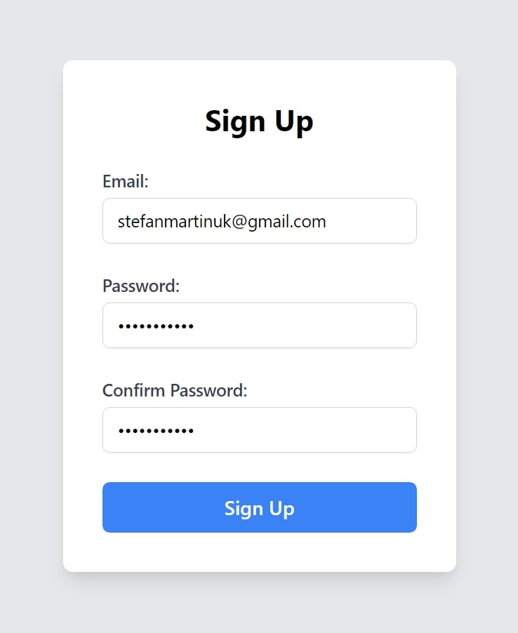
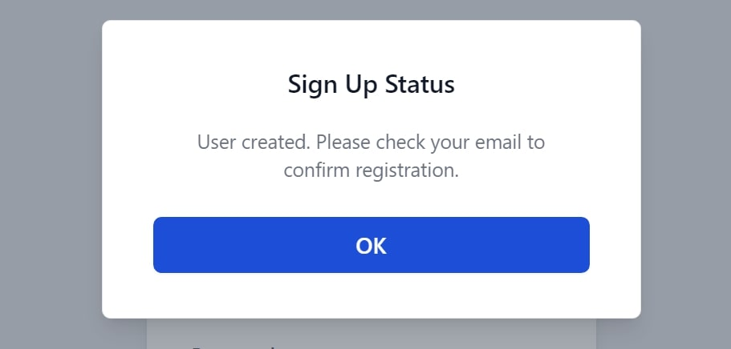
**Verification**

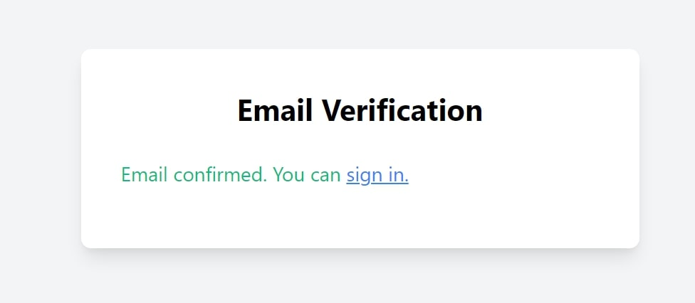

**Sign In to Admin dashboard**
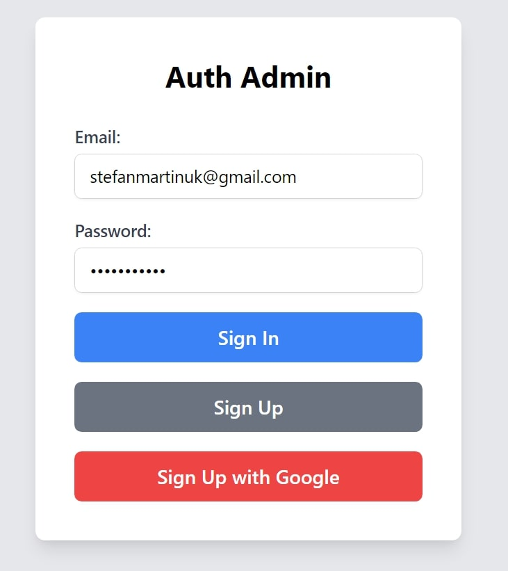
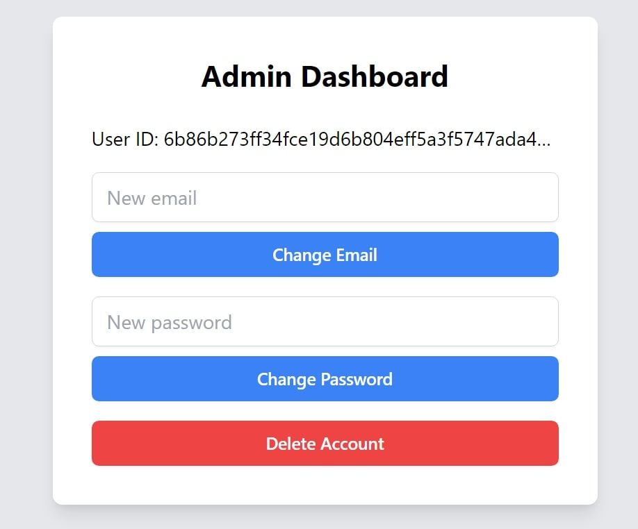

### Manage user data
**By moving moves on the User Id you can simply copy it by click**
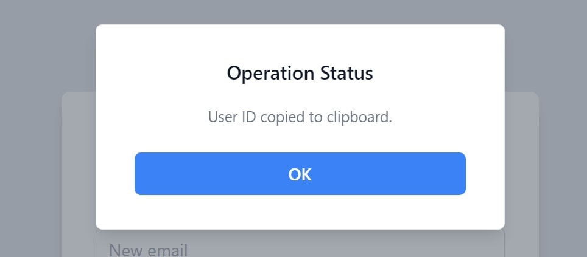
**From Admin you can change the email and password in simple two clicks**
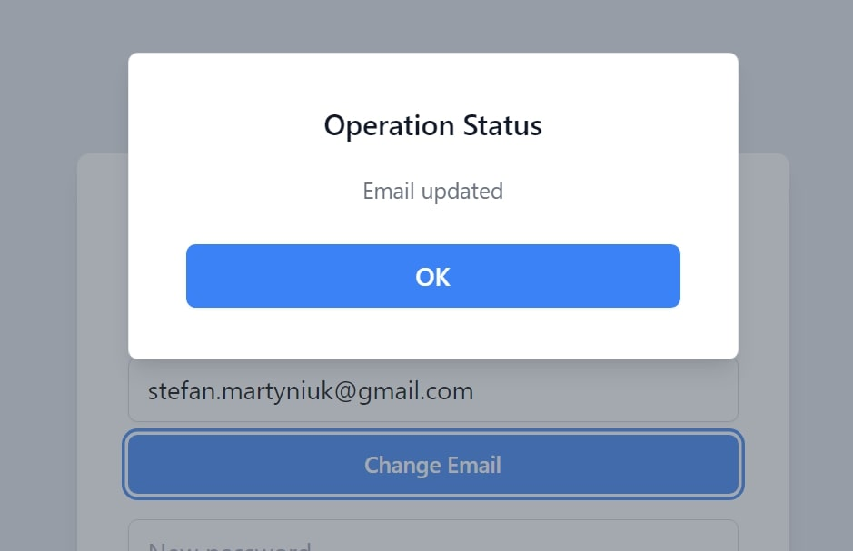
**Lastly, you can delete the user account**
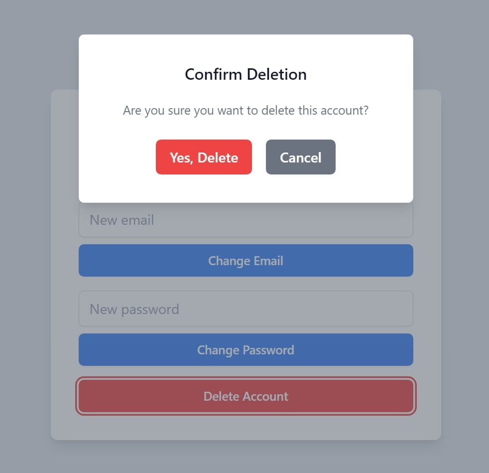

### Sign Up with Google
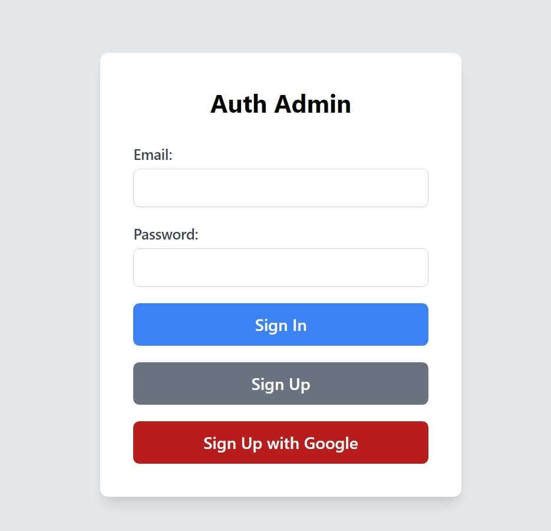
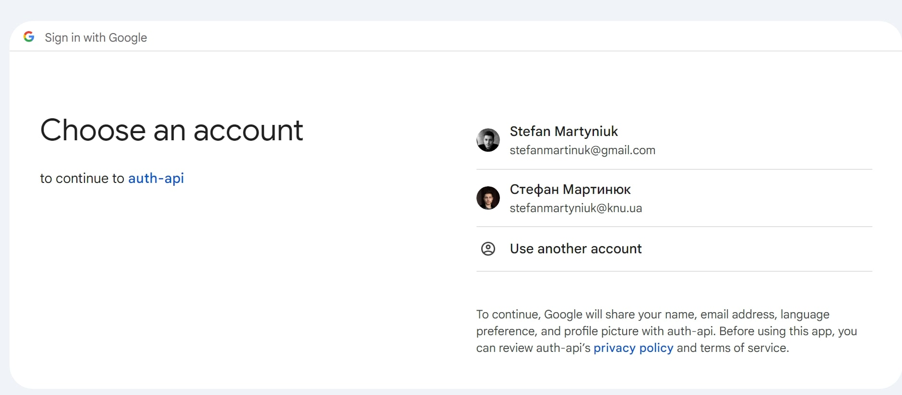
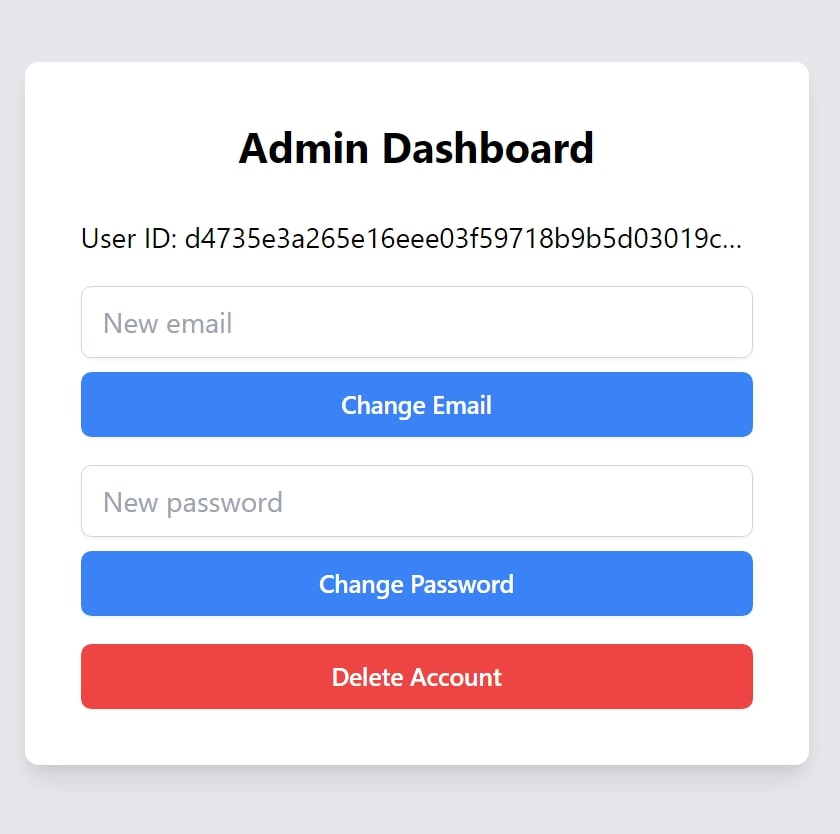

## Anonym Chat Usage Example

### Email Verification for Chat
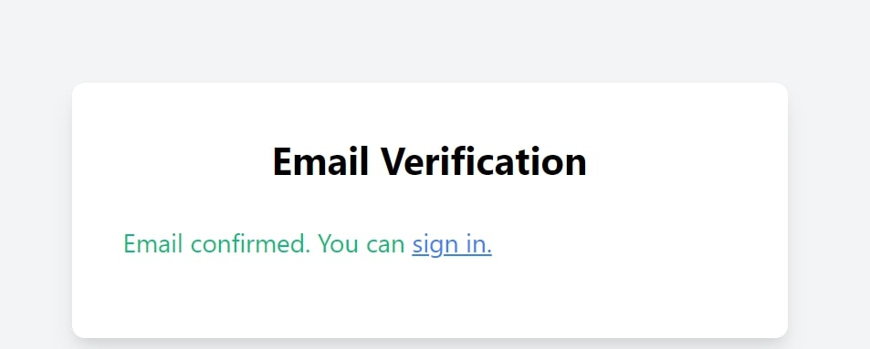


### Sign In to Chat
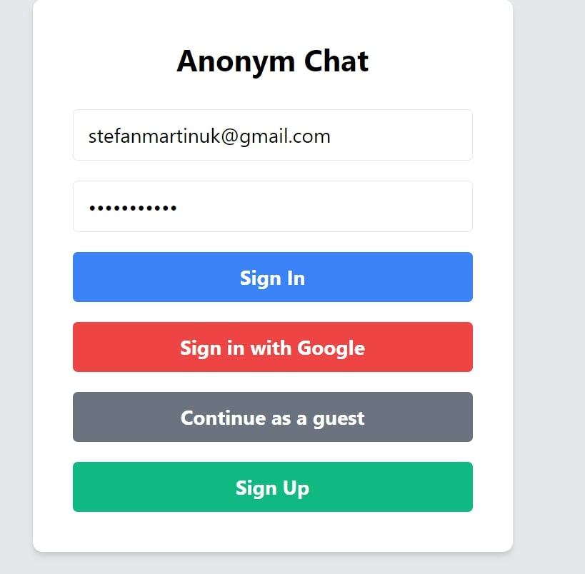

### Sign Up for Chat
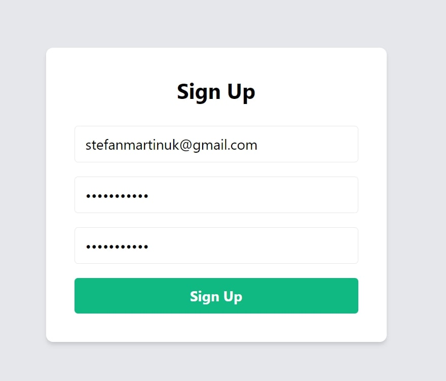
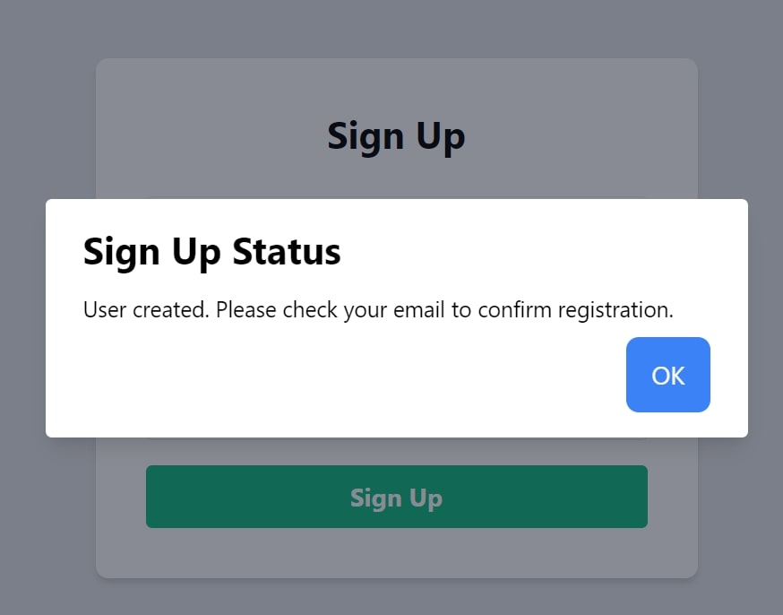

### Manage Multiple Chat Sessions
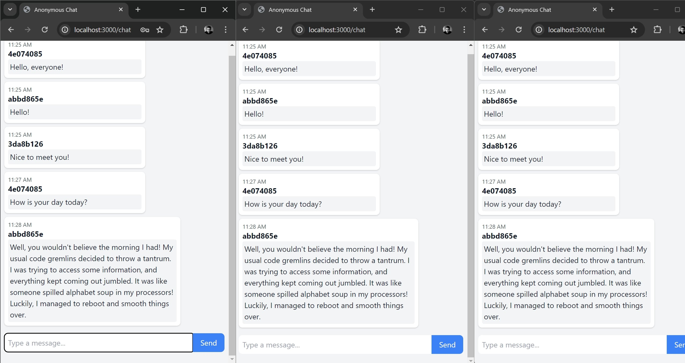